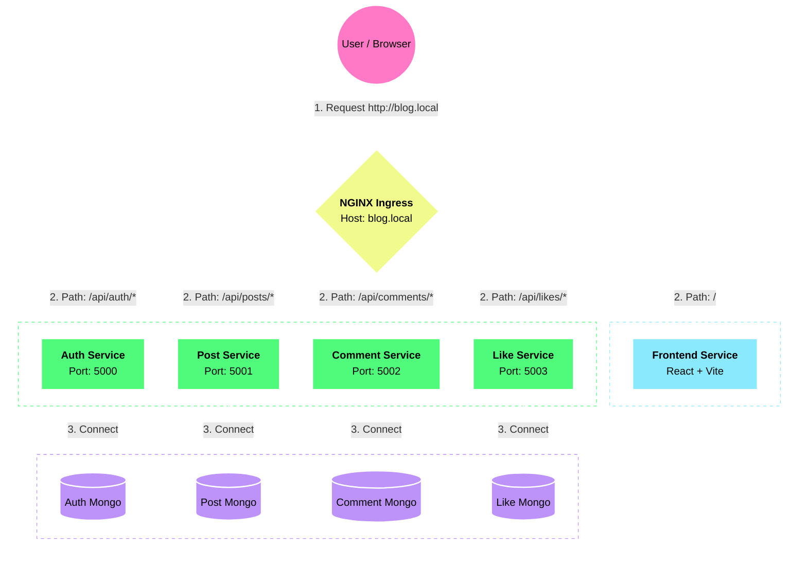

# 📝 BlogApp

A scalable, full-stack blogging platform built using a **Microservices Architecture**. The application is containerized with **Docker**, orchestrated with **Kubernetes**, and uses **NGINX Ingress** for routing.


## 🏗 Architecture

The application is decomposed into independent services, each with its own database to ensure loose coupling and independent scalability.

* **Frontend Service:** React (Vite + TypeScript)
* **Auth Service:** Handles User Registration, Login, and JWT generation.
* **Post Service:** Handles CRUD operations for Blog Posts.
* **Comment Service:** Manages comments on posts.
* **Like Service:** Manages likes on posts.
* **Ingress Controller:** NGINX handles routing between the frontend and backend services.

## 🛠 Tech Stack

* **Frontend:** React, TypeScript, TailwindCSS, Vite
* **Backend:** Node.js, Express, TypeScript
* **Database:** MongoDB (Per-service database pattern)
* **DevOps:** Docker, Kubernetes (Minikube/Docker Desktop), NGINX Ingress
* **Authentication:** JWT (JSON Web Tokens)

## 🚀 Prerequisites

Before you begin, ensure you have the following installed:
* [Docker Desktop](https://www.docker.com/products/docker-desktop/)
* [Kubernetes CLI (kubectl)](https://kubernetes.io/docs/tasks/tools/)
* [Minikube](https://minikube.sigs.k8s.io/docs/start/) (Optional, if not using Docker Desktop's K8s)





## 📦 Installation & Deployment

### 1. Clone the Repository
```bash
git clone [https://github.com/shounak26/blogapp_microservices.git](https://github.com/shounak26/blogapp_microservices.git)
cd blogapp_microservices

```


---

### 2. Configure Hosts File

The Ingress is configured for the host **`blog.local`**, so you must map it to your local machine.

**Windows:**

1. Open Notepad as Administrator
2. Edit: `C:\Windows\System32\drivers\etc\hosts`

**Mac/Linux:**

```bash
sudo nano /etc/hosts
```

Add this line:

```
127.0.0.1   blog.local
```

---

### 3. Deploy to Kubernetes

Apply manifests **in order** so databases, secrets, and services initialize correctly.

```bash
# 1. Apply Secrets and ConfigMaps
kubectl apply -f k8s/secrets.yml
kubectl apply -f k8s/configMap.yml

# 2. Create Persistent Volume Claims (Storage)
kubectl apply -f k8s/mongo-pvc.yml

# 3. Deploy MongoDB Databases
kubectl apply -f k8s/mongo-deployments.yml

# 4. Deploy Backend Microservices
kubectl apply -f k8s/backend-auth.yml
kubectl apply -f k8s/backend-post.yml
kubectl apply -f k8s/backend-comment.yml
kubectl apply -f k8s/backend-like.yml

# 5. Deploy Frontend
kubectl apply -f k8s/frontend.yml

# 6. Apply Ingress Routes
kubectl apply -f k8s/ingress-backend.yml
kubectl apply -f k8s/ingress-frontend.yml

# 7. Apply Horizontal Pod Autoscaler
kubectl apply -f k8s/hpa.yml
```

---

### 4. Access the Application

Open:

👉 **[http://blog.local](http://blog.local)**

---

## 🔧 Environment Variables

### Kubernetes Secrets (`secrets.yml`)

All values must be **Base64 encoded**.

```
MONGO_ROOT_USERNAME
MONGO_ROOT_PASSWORD
JWT_SECRET
```

### ConfigMap (`configMap.yml`)

Contains:

* `AUTH_MONGO_URI`
* `POST_MONGO_URI`
* `COMMENT_MONGO_URI`
* `LIKE_MONGO_URI`
* Service URLs for internal cluster communication

Example:

```
AUTH_MONGO_URI=mongodb://auth-mongo:27017/authService
POST_MONGO_URI=mongodb://post-mongo:27017/postService
```

---

## 🔌 API Endpoints

### Ingress Routing Overview

| Service         | Path Prefix     | Description         |
| --------------- | --------------- | ------------------- |
| Frontend        | `/`             | React application   |
| Auth Service    | `/api/auth`     | Register/Login/JWT  |
| Post Service    | `/api/posts`    | CRUD on posts       |
| Comment Service | `/api/comments` | Manage comments     |
| Like Service    | `/api/likes`    | Like / Unlike posts |

## Horizontal Pod Autoscaler (HPA) – Auto-scaling in action

All backend microservices and the frontend are configured with **Horizontal Pod Autoscaling** based on CPU utilization.  
When traffic spikes, Kubernetes automatically scales the number of pods to maintain performance.

| Service            | Target CPU | Min Pods | Max Pods | Current Behavior (tested)                     |
|---------------------|------------|----------|----------|-----------------------------------------------|
| Auth Service        | 60%        | 1        | 10       | Scales instantly under registration storms   |
| Post Service        | 60%        | 1        | 10       | Went from 1 → 10 pods                         |
| Comment Service     | 60%        | 1        | 10       | Scales during comment floods                  |
| Like Service        | 60%        | 1        | 10       | Scales on viral posts                         |
| Frontend (React)    | 50%        | 2        | 15       | Keeps UI responsive under heavy traffic       |

### How to see it live (30-second demo)

```bash
# 1. Hammer the Post service
kubectl run load-generator --rm -i --tty --image=busybox -n blogapp -- /bin/sh -c \
  "while true; do wget -q -O- http://post-service:5001/api/posts; done"

# 2. In another terminal, watch the magic
kubectl get hpa post-service-hpa -n blogapp -w
kubectl get pods -n blogapp -l app=post-service -w

```
